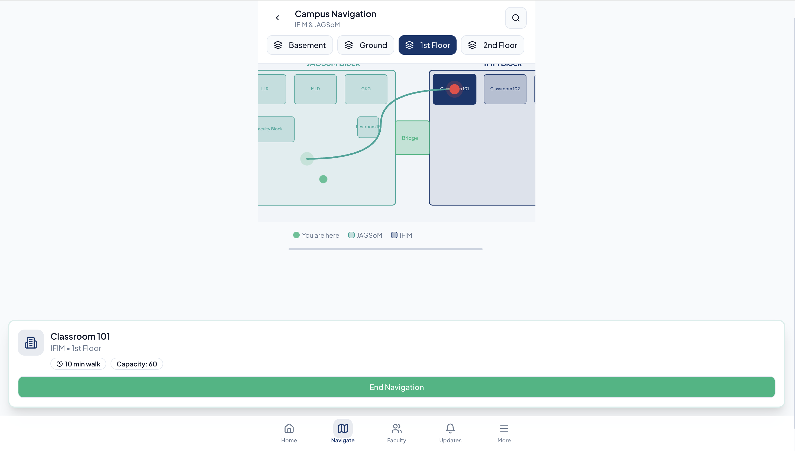

# Smart Campus 

## A Human-Centered Design Thinking and Business Analysis Case Study

This repository showcases a Design Thinking project that addresses one of the most common challenges faced by university students—fragmented academic information and inefficient campus navigation.

The project applies a structured Business Analysis and Design Thinking approach to understand user pain points, define business requirements, prototype solutions, validate assumptions through user testing, and recommend a scalable digital solution.

Rather than focusing solely on technology, this project demonstrates how user research and business analysis can be used to solve real-world operational problems.

---

# Project Overview

Students on large university campuses frequently spend valuable time searching for classrooms, locating faculty members, checking announcements across multiple platforms, and navigating unfamiliar campus buildings.

This project proposes Smart Campus Companion, a centralized digital platform designed to simplify everyday academic activities through contextual guidance, real-time information, and intuitive campus navigation.

The solution was developed using the Design Thinking framework and validated through multiple rounds of user research and prototyping.

---

# Business Problem

The institution relied on multiple disconnected platforms for communicating academic information.

Students experienced:

- Difficulty locating classrooms and faculty cabins
- Fragmented information across ERP, LMS, email, WhatsApp, and notice boards
- Missed academic announcements
- Excessive time spent navigating campus
- High cognitive load during routine academic activities

These challenges negatively impacted student productivity and overall campus experience.

---

# Business Objective

The primary objectives of this project were to:

- Understand student pain points through user research.
- Identify gaps in the existing information system.
- Develop a centralized digital solution.
- Improve campus navigation.
- Reduce time spent searching for information.
- Enhance student experience through contextual guidance.

---

# Design Thinking Process

The project followed the complete Design Thinking methodology.

## 1. Empathize

- User Interviews
- Student Surveys
- Observation
- Empathy Mapping

---

## 2. Define

Activities performed:

- Problem Definition
- Root Cause Analysis
- Point of View Statements
- "How Might We" Questions

---

## 3. Ideate

Multiple solution concepts were generated using structured brainstorming techniques including:

- Brainstorming
- Brainwriting
- SCAMPER
- Dot Voting
- Impact vs Effort Matrix

The strongest concepts were combined into one unified solution.

---

## 4. Prototype

Four iterations of the solution were developed.

Version 1

Paper Prototype

Version 2

Interactive Wireframe

Version 3

ERP-integrated Prototype

Version 4

Context-Aware Smart Campus Companion

Prototype developed using:

- Lovable.dev
- Replit
- Visual Studio Code

---

## 5. Test

The prototype was evaluated through user testing using:

- Think-Aloud Protocol
- Scenario-Based Testing
- Feedback Collection
- Iterative Improvements

Testing focused on:

- Navigation
- Faculty Availability
- Academic Updates
- Overall User Experience

---

# Business Analysis Deliverables

This project includes several Business Analysis artifacts commonly used in industry.

- Problem Statement
- Stakeholder Analysis
- User Research
- Empathy Maps
- Personas
- User Journey Maps
- Point of View Statements
- How Might We Questions
- Ideation Matrix
- Solution Evaluation
- Prototype Iterations
- User Testing
- Business Recommendations

---

# Solution Features

The proposed Smart Campus Companion includes:

- Smart Campus Navigation
- Timetable-based Navigation
- Faculty Availability Dashboard
- Appointment Booking
- Centralized Academic Updates
- Context-Aware Notifications
- QR-based Location Assistance
- Landmark-based Indoor Navigation

---

# Project Outcomes

The final solution demonstrated measurable improvements during user testing.

Key outcomes included:

- Reduced task completion time
- Reduced faculty waiting time
- Improved navigation efficiency
- Better access to academic information
- Higher user satisfaction

---

# Skills Demonstrated

This project demonstrates practical skills relevant to Business Analysis, Product Management, and Data Analytics.

Business Analysis

- Requirements Gathering
- Problem Definition
- Stakeholder Analysis
- Gap Analysis
- User Research
- Business Documentation
- Process Improvement
- Solution Evaluation

Product Thinking

- Human-Centered Design
- Design Thinking
- MVP Development
- Product Validation
- User-Centered Design
- Feature Prioritization

Analytical Skills

- Qualitative Research
- Survey Analysis
- Data Interpretation
- Root Cause Analysis
- Decision Making
- Critical Thinking

---

# Live Prototype

Interactive prototype developed using Lovable.dev:

https://agile-campus-guide.lovable.app

# Prototype Screens

## Landing Page

  

---

## Navigation

  

---

## Navigation Tab

  

---

## Faculty Appointment

  

---

## Events Module

  

---

## Event Registration

  

---

## Student Council

  

---

## Complaints Module

  

---

## Library Overdue Notifications

  

---

## Mail & Call Features

  

## Prototype

  

---

# Academic Project

This repository showcases an academic Design Thinking project completed at Jagdish Sheth School of Management (JAGSoM).

The project was completed collaboratively as part of the academic curriculum.

---

# My Contributions

My primary contributions to this project include:

- Conducted user research and interviews.
- Contributed to stakeholder and problem analysis.
- Developed business requirements and solution concepts.
- Participated in ideation and feature prioritization.
- Designed and refined prototype iterations.
- Conducted user testing and analyzed findings.
- Prepared project documentation and presentation.
- Created and maintained the GitHub repository.

---

# Career Relevance

This project demonstrates practical competencies required for Business Analyst and Data Analyst roles, including:

- Business Problem Solving
- Requirements Analysis
- Process Improvement
- User Research
- Decision-Making
- Data-Informed Product Design
- Stakeholder-Centric Solution Development

The project illustrates how structured analysis and user-centered design can be combined to create practical digital solutions for real-world business problems.

---

# Future Enhancements

Potential future enhancements include:

- ERP Integration
- Indoor Navigation using Bluetooth Beacons
- AI-powered Campus Assistant
- Predictive Faculty Availability
- Analytics Dashboard for Campus Administration
- Mobile Application Deployment

---

# Author

**Jenifa X**

PGDM – Business Analytics 

Jagdish Sheth School of Management (JAGSoM)

**GitHub:** https://github.com/Jenifa-03

**LinkedIn:** www.linkedin.com/in/jenifa-x

---

# Acknowledgement

This repository represents an academic group project completed as part of the Design Thinking course at Jagdish Sheth School of Management (JAGSoM).

The repository is maintained by me to showcase my individual contributions while acknowledging the collaborative efforts of the entire project team.
